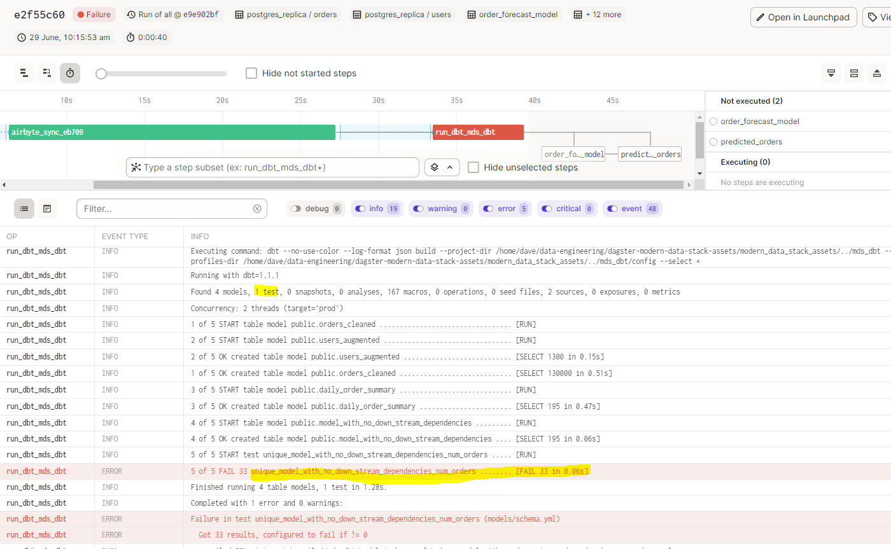

# Issue dbt tests blocking all downstream dependencies when using dagster_dbt.load_assets_from_dbt_project

If a dbt model fails to run or its test fails then I still want upstream models to continue if they dont have a dependency on the failing model.

e.g. when following along to the [blog](https://dagster.io/blog/software-defined-assets) we load all our assets with the dbt build command so tests run:

```python
from dagster_dbt import load_assets_from_dbt_project

DBT_PROJECT_DIR = '..'

dbt_assets = load_assets_from_dbt_project(
    project_dir=DBT_PROJECT_DIR, io_manager_key="pandas_io_manager",
    select='mds_dbt',
    use_build_command=True
)
```

But as soon as i add a new model with no downstream dependencies and create a failing test then the upstream dependencies are skipped.



How do i get those upstream dependencies to continue if none of there dependencies have failed?

Example of the changes i made to [blog](https://dagster.io/blog/software-defined-assets) : 